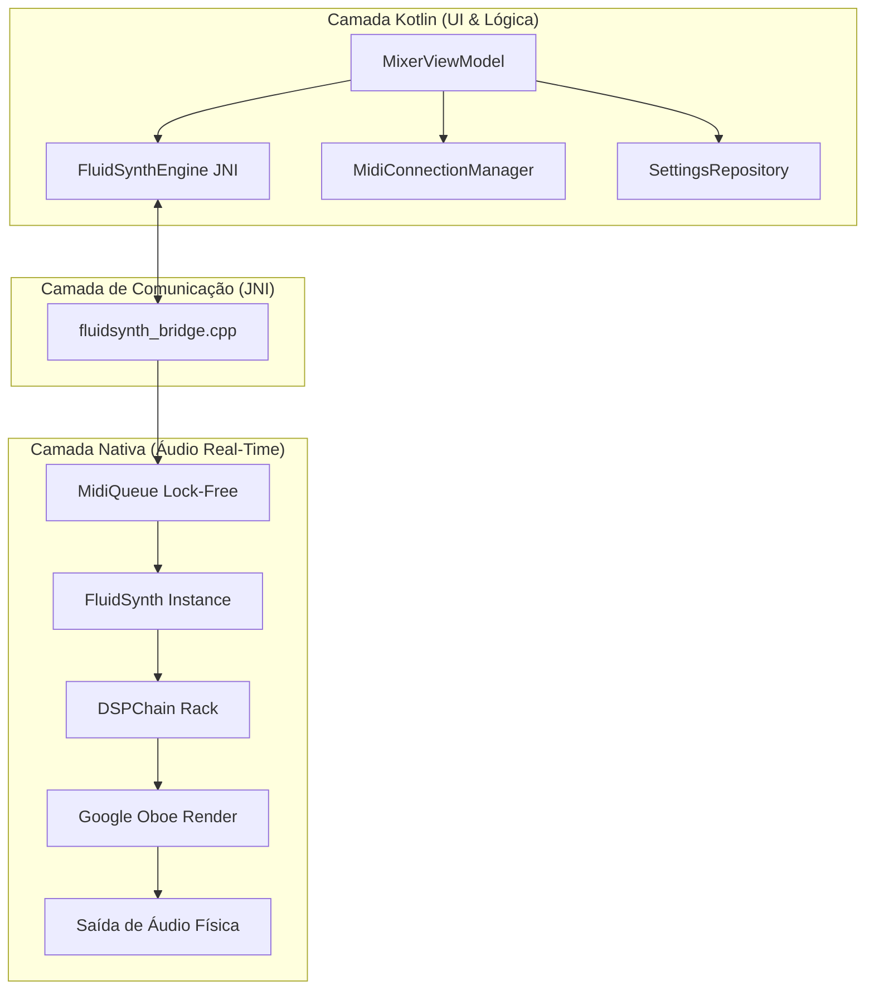
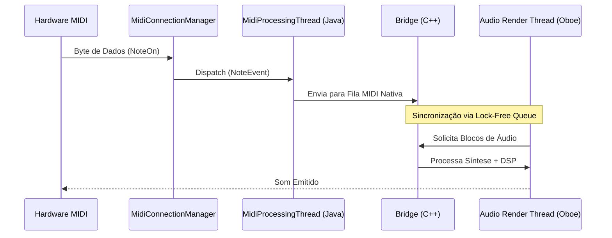

# Arquitetura do Sistema: StageMobile

Este documento detalha a infraestrutura técnica, as decisões de design e a organização dos componentes do projeto StageMobile.

## 1. Visão Geral da Arquitetura
O StageMobile utiliza uma arquitetura híbrida de alto desempenho, separando a interface reativa (Jetpack Compose) do motor de processamento crítico (C++).

## 2. Stack Tecnológica
- **Linguagem Principal:** Kotlin (Android) e C++20 (Motor de Áudio).
- **Interface Gráfica:** Jetpack Compose (Material 3).
- **Motor de Áudio (Nativo):**
    - **FluidSynth:** Síntese de áudio baseada em Wavetables (SoundFonts).
    - **Oboe:** API de áudio C++ da Google para latência ultra-baixa.
    - **STK (Synthesis Toolkit):** Algoritmos de efeitos DSP (Chorus, Reverb, EQ, etc.).
    - **SoundTouch:** Manipulação de Pitch e Time-stretch.
- **Gerenciamento MIDI:** Android MidiManager API.

## 3. Fluxo de Dados MIDI (Threading Model)
A estabilidade do áudio é garantida pela separação total das threads de processamento.

## 4. Componentes e Papéis Detalhados

### 4.1 Camada de UI (Kotlin/Compose)
- **`MixerViewModel`:** Detém a "Single Source of Truth". Orquestra o estado de 16 canais e sincroniza com o motor nativo.
- **`InstrumentChannelStrip`:** Conecta o estado do modelo `InstrumentChannel` aos controles visuais (`Faders`, `Knobs`).
- **`MidiLearnModifiers`:** Gerencia o estado visual de "escuta" durante o mapeamento de hardware.

### 4.2 Camada de Domínio e Persistência
- **`InstrumentChannel`:** Estrutura de dados contendo `volume`, `pan`, `mute`, `solo`, `armed` e o mapeamento do `sfId`.
- **`SettingsRepository`:** Gerencia a persistência via `SharedPreferences`. Utiliza JSON para serializar mapeamentos complexos de MIDI Learn.

### 4.3 Utilitários de Performance
- **`SystemResourceMonitor`:**
    - **PSS Anchor:** Atualizado a cada 30 segundos (evita overhead de syscalls).
    - **Native Delta:** Medição instantânea via `getNativeHeapAllocatedSize()` para refletir carregamentos de SF2.

## 5. Decisões Arquiteturais Críticas
1.  **Imutabilidade na UI:** O estado dos canais é exposto via `StateFlow` imutável, garantindo recomposições eficientes no Compose.
2.  **Order-Preserving DSP:** O rack nativo (`DSPChain`) processa efeitos em uma lista linear. A ordem (HPF -> LPF -> Dynamics -> EQ -> Mod -> Time -> Limiter) é fixa no nível de motor para garantir a fase e o timbre.
## 6. Diretrizes de Desenvolvimento (Best Practices)
1.  **Componentização Obrigatória:** Qualquer funcionalidade, elemento de interface ou lógica de estado que seja utilizada em mais de uma tela do sistema **deve** ser extraída para um componente reutilizável (ex: `StageToast`, `StageToastHost`). Isso garante consistência visual, evita duplicidade de lógica e facilita a manutenção.
2.  **Latência Zero:** Toda implementação na camada nativa deve evitar alocações de memória ou locks no ciclo de renderização de áudio.
3.  **Responsividade Mobile:** Todos os elementos de UI devem considerar o estado `isTablet` para adaptar tamanhos e densidade de informação, garantindo usabilidade em celulares e tablets.
4.  **Integridade de Código:** Antes de concluir qualquer refatoração, siga rigorosamente o [Protocolo de Prevenção de Erros](file:///Users/macbookpro/AndroidStudioProjects/StageMobile/docs/developer_guide.md#6-protocolo-de-integridade-de-código-prevenção-de-erros).
5.  **Carregamento Assíncrono:** Operações pesadas (Banco de Dados, JNI, I/O) de troca de presets **devem** ocorrer em `Dispatchers.Default` ou `IO`, mantendo a fluidez da navegação para o usuário.
6.  **Consistência de MIDI Learn:** O ícone `AutoFixHigh` (Varinha Mágica) em amarelo é o padrão global para entrar no modo de mapeamento.
