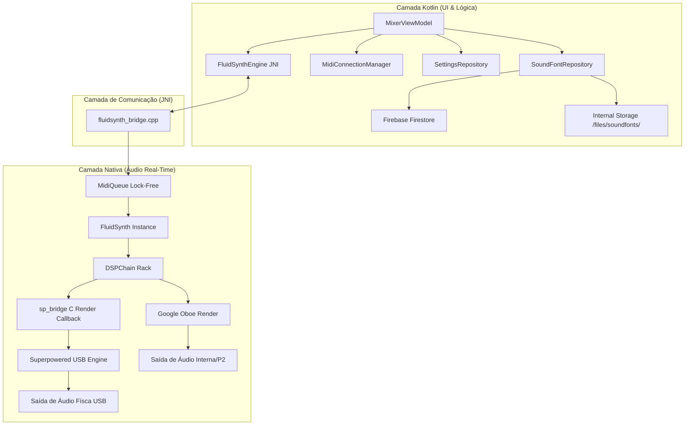
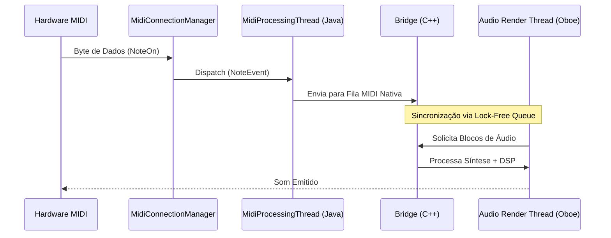

# Arquitetura do Sistema: StageMobile

Este documento detalha a infraestrutura técnica, as decisões de design e a organização dos componentes do projeto StageMobile.

## 1. Visão Geral da Arquitetura
O StageMobile utiliza uma arquitetura híbrida de alto desempenho, separando a interface reativa (Jetpack Compose) do motor de processamento crítico (C++).



## 2. Stack Tecnológica
- **Linguagem Principal:** Kotlin (Android) e C++20 (Motor de Áudio).
- **Interface Gráfica:** Jetpack Compose (Material 3).
- **Motor de Áudio (Nativo):**
    - **FluidSynth:** Síntese de áudio baseada em Wavetables (SoundFonts).
    - **Oboe:** API de áudio C++ da Google para latência ultra-baixa (Dispositivos Internos).
    - **Superpowered SDK:** (Isolado no módulo `:superpowered-usb`) via Áudio USB direto em Hardware Bypass. Comunicação inter-bibliotecas feita por ponte C (`extern "C"` / `dlopen`).
    - **STK (Synthesis Toolkit):** Algoritmos de efeitos DSP (Chorus, Reverb, EQ, etc.).
    - **SoundTouch:** Manipulação de Pitch e Time-stretch.
- **Gerenciamento MIDI:** Android MidiManager API.

## 3. Fluxo de Dados MIDI (Threading Model)
A estabilidade do áudio é garantida pela separação total das threads de processamento.



### 3.1 Estabilidade DSP (Glitch-Free)
Para garantir a ausência de clicks e pops durante ajustes em tempo real, o sistema adota:
1.  **Parameter Smoothing:** Interpolação exponencial (`SmoothedParam`) para parâmetros de ganho, tempo e filtros.
2.  **Filter Crossfading:** Double-buffering de filtros IIR (EQ, HPF, LPF) com transição suave (64 samples) ao alterar frequências.
3.  **Lock-Free Bridge:** Parâmetros críticos são transmitidos via `std::atomic`, eliminando a contenção de mutex entre a UI thread e a Audio Render thread.

### 3.2 Thread Affinity e Prioridade (Big Cluster Pinning)
A thread `synthRenderLoop` é pinned ao big cluster do SoC em runtime via detecção de frequência máxima lendo `/sys/devices/system/cpu/cpuN/cpufreq/cpuinfo_max_freq`:

- **Exynos 1380 (Tab S9 FE):** detecta cores 4-7 (Cortex-A78 @ 2.4GHz), ignora cores 0-3 (A55 @ 2.0GHz).
- **Snapdragon 8 Gen 3 (S24 Ultra):** detecta o prime core (Cortex-X4).
- **Qualquer SoC:** funciona sem hardcode — escolhe todas as cores com a freq máxima.

Prioridade: tenta `SCHED_FIFO` (realtime), Android nega com `EPERM` para apps de usuário, fallback automático para `nice=-19` (máxima prioridade normal). Isso elimina preempção pelo scheduler e migração entre big/little cores, que eram as causas principais de spikes intermitentes em `MaxFluid`/`MaxDspCh`/`MaxMix` sem causa algorítmica.

Ver [audio_performance_tuning.md](./audio_performance_tuning.md) para o código e justificativa detalhada.

### 3.3 APM Per-Phase Instrumentation
O `renderAudioEngine` é instrumentado com a macro `MEASURE_PHASE` que combina `clock_gettime` + `ATrace_beginSection/endSection`. As fases rastreadas são:

1. **SM.Fluid** — `fluid_synth_nwrite_float`
2. **SM.DspChan** — loop de 16 canais DSP
3. **SM.DspMaster** — master rack DSP
4. **SM.Mix** — scalar mix/interleave/clip detect

As métricas ficam disponíveis via `nativeGetAudioStats` (retorna FloatArray[14]) e são exibidas no APM HUD ([APMHudDialog.kt](../app/src/main/java/com/marceloferlan/stagemobile/ui/components/APMHudDialog.kt)) com colorização (verde <1ms, amarelo >1ms, vermelho >2ms). Os mesmos markers ficam visíveis em traces Perfetto capturados durante sessões de teste.


## 4. Componentes e Papéis Detalhados

### 4.1 Camada de UI (Kotlin/Compose)
- **`MixerViewModel`:** Detém a "Single Source of Truth". Orquestra o estado de 16 canais e sincroniza com o motor nativo.
- **`InstrumentChannelStrip`:** Conecta o estado do modelo `InstrumentChannel` aos controles visuais (`Faders`, `Knobs`).
- **`MidiLearnModifiers`:** Gerencia o estado visual de "escuta" durante o mapeamento de hardware.

### 4.2 Camada de Domínio e Persistência
- **`InstrumentChannel`:** Estrutura de dados contendo `volume`, `pan`, `mute`, `solo`, `armed` e o mapeamento do `sfId`.
- **`SettingsRepository`:** Gerencia a persistência via `SharedPreferences`. Utiliza JSON para serializar mapeamentos complexos de MIDI Learn.
- **`SoundFontRepository`:** Gerencia a biblioteca interna de instrumentos. Sincroniza metadados (tags, categorias) com o Firebase Firestore e gerencia arquivos no diretório privado do app, garantindo portabilidade dos Set Stages.

### 4.3 Camada de Dados (Firebase)
- **Firebase Firestore:** Utilizado para armazenamento de metadados dos SoundFonts. Possui persistência offline habilitada, permitindo que o músico gerencie sua biblioteca mesmo sem internet durante o show. Sincroniza automaticamente quando a conexão é restabelecida.

### 4.3 Utilitários de Performance
- **`SystemResourceMonitor`:**
    - **PSS Anchor:** Atualizado a cada 30 segundos (evita overhead de syscalls).
    - **Native Delta:** Medição instantânea via `getNativeHeapAllocatedSize()` para refletir carregamentos de SF2.

## 5. Decisões Arquiteturais Críticas
1.  **Imutabilidade na UI:** O estado dos canais é exposto via `StateFlow` imutável, garantindo recomposições eficientes no Compose.
2.  **Order-Preserving DSP:** O rack nativo (`DSPChain`) processa efeitos em uma lista linear. A ordem (HPF -> LPF -> Dynamics -> EQ -> Mod -> Time -> Limiter) é fixa no nível de motor para garantir a fase e o timbre.
3.  **Lock-Free DSP Parameters:** Decisão de não usar mutex para `setEffectParam` e `setEffectEnabled`, priorizando a continuidade do áudio sobre a atomicidade estrutural (que permanece protegida por mutex apenas em `add/removeEffect`).
4.  **Merged Voice Rendering:** O FluidSynth renderiza todas as vozes de um canal em um buffer stereo comum (`fluid_synth_nwrite_float`). Isso impede o processamento DSP individual por voz (ex: aplicar efeito apenas em notas novas), pois o sinal chega ao DSPChain já mesclado.
5.  **Auth Guard no Compose (não na Activity):** O roteamento de autenticação é feito dentro do `setContent` do `MainActivity`, verificando `Firebase.auth.currentUser` via `remember`. Isso evita múltiplas Activities e mantém todo o estado Compose no mesmo escopo. O guard usa `return@Surface` para interromper a composição da árvore do Mixer enquanto o usuário não está autenticado.
6.  **Feature Gating via Firebase Custom Claims:** Funcionalidades premium (add-ons) são controladas por Custom Claims no token JWT do Firebase Auth, não por flags locais ou documentos Firestore. Motivo: Custom Claims são assinadas pelo Firebase e não podem ser adulteradas pelo app. O fluxo de validação passa obrigatoriamente por uma Cloud Function server-side que verifica o recibo de compra com a API do Google Play Developer antes de setar a claim.

## 6. Diretrizes de Desenvolvimento (Best Practices)
1.  **Componentização Obrigatória:** Qualquer funcionalidade, elemento de interface ou lógica de estado que seja utilizada em mais de uma tela do sistema **deve** ser extraída para um componente reutilizável (ex: `StageToast`, `StageToastHost`). Isso garante consistência visual, evita duplicidade de lógica e facilita a manutenção.
2.  **Latência Zero:** Toda implementação na camada nativa deve evitar alocações de memória ou locks no ciclo de renderização de áudio.
3.  **Responsividade Mobile:** Todos os elementos de UI devem considerar o estado `isTablet` para adaptar tamanhos e densidade de informação, garantindo usabilidade em celulares e tablets.
4.  **Integridade de Código:** Antes de concluir qualquer refatoração, siga rigorosamente o [Protocolo de Prevenção de Erros](file:///Users/macbookpro/AndroidStudioProjects/StageMobile/docs/developer_guide.md#6-protocolo-de-integridade-de-código-prevenção-de-erros).
5.  **Carregamento Assíncrono:** Operações pesadas (Banco de Dados, JNI, I/O) de troca de presets **devem** ocorrer em `Dispatchers.Default` ou `IO`, mantendo a fluidez da navegação para o usuário.
6.  **Consistência de MIDI Learn:** O ícone `AutoFixHigh` (Varinha Mágica) em amarelo é o padrão global para entrar no modo de mapeamento.

## 7. Modelo de Autenticação e Monetização

### 7.1 Firebase Auth — Camada de Identidade
Todos os usuários do app possuem uma identidade Firebase Auth (`uid`) criada no primeiro acesso. O SDK persiste o token localmente (SharedPreferences internas) — o login é solicitado apenas na primeira instalação ou após "Limpar Dados".

```
Provedores ativos: Email/Senha | Google Sign-In
Arquivo central: data/AuthRepository.kt
Guard de acesso: MainActivity.kt → return@Surface se currentUser == null
```

### 7.2 Firebase Custom Claims — Feature Gating
Add-ons futuros usam Custom Claims no JWT do usuário. Claims planejadas:

| Claim | Tipo | Feature |
|---|---|---|
| `audioDriverAddon` | `Boolean` | Seletor de Driver de Áudio USB |

**Regra de ouro:** Nunca verificar permissões de add-on via Firestore ou SharedPreferences locais. Sempre usar `FirebaseUser.getIdToken()` para ler claims atualizadas.

### 7.3 Google Play Billing — Fluxo de Compra
Ver especificação completa em `docs/features.md` seção 12.

