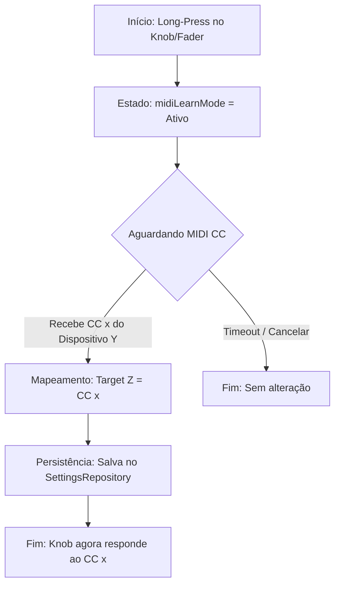
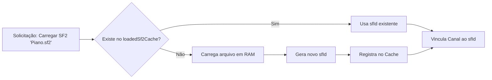
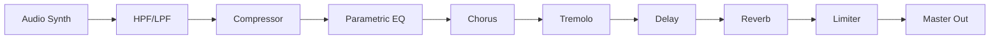

# Funcionalidades e Requisitos: StageMobile

Este documento descreve as capacidades funcionais do StageMobile, detalhando os fluxos de operação e as regras de negócio.

## 1. Fluxo de MIDI Learn (Mapeamento de Hardware)
O MIDI Learn permite que o músico vincule controladores físicos (Knobs, Sliders) aos parâmetros da interface de forma dinâmica.

## 2. Gerenciamento de SoundFonts e Cache de Memória
Para otimizar o uso de RAM, o sistema evita carregar o mesmo arquivo SF2 múltiplas vezes.

## 3. Cadeia de Sinal DSP (Signal Chain)
A ordem dos efeitos é crítica para a sonoridade profissional. O sinal flui linearmente através do rack nativo.

## 4. Regras de Negócio por Componente

### 4.1 Armamento de Canal (Armed State)
- **Regra:** Apenas canais com o estado `isArmed = true` processam mensagens de `NoteOn` do barramento global.
- **Exceção:** Mensagens de `ControlChange` (Volume/Pan) são processadas mesmo se o canal não estiver armado, desde que o mapeamento MIDI Learn exista.

### 4.2 Polifonia e Performance
- **Dynamic Voice Allocation:** O FluidSynth gerencia as vozes com base no limite configurado globalmente (16 a 256).
- **Prioridade:** Notas mais antigas são cortadas (Kill) se o limite for atingido, priorizando a sustentação das notas mais recentes.

### 4.3 Curvas de Velocity
O sistema aplica uma transformação matemática ao valor de velocity MIDI (0-127) antes de enviá-lo ao sintetizador:
- **Linear:** Direto (1:1).
- **Soft/Hard:** Curvas exponenciais para compensar a resistência física de diferentes teclados controladores.
- **S-Curve:** Compressão de dinâmica nas extremidades.

## 5. Requisitos Não Funcionais (NFR)
- **Zero Latency:** Prioridade absoluta para a Thread de Renderização (Oboe).
- **Stability:** O sistema deve suportar trocas abruptas de presets sem travamentos ou spikes de áudio (Glitch-free).
- **Scalability:** O layout e o motor devem suportar de 1 a 16 canais sem degradação perceptível de performance em dispositivos modernos.
