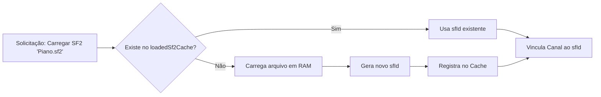
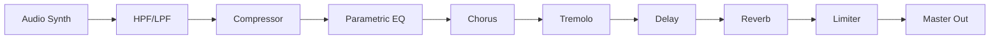

# Funcionalidades e Requisitos: StageMobile

Este documento descreve as capacidades funcionais do StageMobile, detalhando os fluxos de operação e as regras de negócio.

## 1. Fluxos de MIDI Learn (Mapeamento de Hardware)
O MIDI Learn permite que o músico vincule controladores físicos (Knobs, Sliders, Pads) aos parâmetros da interface de forma dinâmica.

### 1.1 Mapeamento de Parâmetros DSP
- **Modo:** Toque longo no componente alvo.
- **Escopo:** Global ou por canal.

### 1.2 Mapeamento de Set Stages (Relative Mapping)
Para evitar conflitos entre múltiplos bancos, o sistema utiliza o conceito de **Mapeamento Relativo**:
- **Slots 1-15:** Vinculados ao banco atualmente visível na tela de Sets.
- **Navegação de Bancos:** Alvos MIDI dedicados para `Bank +` e `Bank -`.
- **Set Favorito:** Atalho global `FAVORITE_SET` para carregar um preset mestre instantaneamente (ex: Banco 1, Slot 1).

## 2. Gerenciamento de SoundFonts e Cache de Memória
Para otimizar o uso de RAM, o sistema evita carregar o mesmo arquivo SF2 múltiplas vezes.

## 3. Cadeia de Sinal DSP (Signal Chain)
A ordem dos efeitos é crítica para a sonoridade profissional. O sinal flui linearmente através do rack nativo.

## 4. Regras de Negócio por Componente

### 4.1 Armamento de Canal (Armed State)
- **Regra:** Apenas canais com o estado `isArmed = true` processam mensagens de `NoteOn` do barramento global.
- **Exceção:** Mensagens de `ControlChange` (Volume/Pan) são processadas mesmo se o canal não estiver armado, desde que o mapeamento MIDI Learn exista.

### 4.2 Polifonia e Performance
- **Dynamic Voice Allocation:** O FluidSynth gerencia as vozes com base no limite configurado globalmente (16 a 256).
- **Prioridade:** Notas mais antigas são cortadas (Kill) se o limite for atingido, priorizando a sustentação das notas mais recentes.

### 4.3 Curvas de Velocity
O sistema aplica uma transformação matemática ao valor de velocity MIDI (0-127) antes de enviá-lo ao sintetizador:
- **Linear:** Direto (1:1).
- **Soft/Hard:** Curvas exponenciais para compensar a resistência física de diferentes teclados controladores.
- **S-Curve:** Compressão de dinâmica nas extremidades.

## 5. Gerenciamento de Sets e Performance
### 5.1 Renomeação e Customização
- **Bancos:** Suportam nomes complementares persistentes (ex: "Show de Sábado").
- **Slots:** Renomeação individual para fácil identificação em palco.

### 5.2 Carregamento Assíncrono (Latency Zero)
O carregamento de Set Stages ocorre em `Dispatchers.Default`, permitindo:
- **Navegação Fluida:** A UI não trava durante a troca de presets.
- **Feedback Imediato:** Toasts de confirmação disparados instantaneamente após o toque.

## 6. Requisitos Não Funcionais (NFR)
- **Zero Latency:** Prioridade absoluta para a Thread de Renderização (Oboe).
- **Stability:** O sistema deve suportar trocas abruptas de presets e ajustes de parâmetros em tempo real sem travamentos ou spikes de áudio (Glitch-free). Implementado via smoothing de parâmetros, crossfade de filtros e ponte JNI lock-free.
- **Scalability:** O layout e o motor devem suportar de 1 a 16 canais sem degradação perceptível de performance em dispositivos modernos.

## 7. Gerenciador Interno de SoundFonts (SF2 Library)
Para eliminar a dependência de arquivos externos e garantir que os Set Stages funcionem em qualquer dispositivo, o sistema utiliza uma biblioteca interna.

### 7.1 Armazenamento Privado
- **Local:** `/data/user/0/stagemobile/files/soundfonts/`
- **Vantagem:** Arquivos importados para esta pasta são imunes a deleções acidentais na galeria ou gerenciador de arquivos do Android.

### 7.2 Metadados e Categorização (Firebase)
- **Sincronização:** Metadados como `tags`, `categorias` e `data de adição` são persistidos no Firebase Firestore.
- **Busca Rápida:** O seletor de instrumentos permite filtrar por categorias (Piano, Pad, Synth, etc.) em vez de navegar por pastas.
- **Tratamento de Conflitos:** O sistema detecta duplicatas por nome de arquivo e solicita confirmação (Substituir/Cancelar) durante a importação.

### 7.3 Integridade de Set Stages
- **Referência:** Set Stages salvos utilizam o nome do arquivo interno.
- **Resiliência:** Ao carregar um set, o sistema prioriza o arquivo na biblioteca interna. Se não existir, tenta o fallback para o URI legado (se disponível no mapa de cache).
- **Aviso de Exclusão:** O sistema impede/alerta a exclusão de um SF2 que esteja sendo utilizado em algum Set Stage salvo nos 10 bancos disponíveis.

### 7.4 Acesso Global (Novo)
- **Menu Lateral**: Adicionado o item "Biblioteca SF2" no Navigation Drawer.
- **Independência**: Permite a manutenção, renomeação e exclusão de instrumentos de forma global (usando `GLOBAL_CHANNEL_ID = -2`), sem a necessidade de acionar um canal de áudio específico.

### 7.5 Filtragem Local Restritiva (Regra Temporária)
- **Regra**: Enquanto o repositório remoto de binários (.sf2) não está implementado no Firebase Storage, o sistema filtra todas as listagens de SoundFonts para exibir **apenas** arquivos que existam fisicamente no dispositivo (`isLocal == true`).
- **Objetivo**: Evitar confusão do usuário com o ícone de nuvem (indicativo de outro dispositivo) em itens que ainda não podem ser baixados diretamente.

## 8. UX de Carregamento e Identificação (Novo)
### 8.1 Auto-Seleção de Preset Único
- **Lógica:** Se um arquivo SF2 possuir apenas 1 preset/programa, o sistema pula o diálogo de seleção e o carrega instantaneamente no canal.
- **Vantagem:** Agiliza a montagem de sets em palco para instrumentos de timbre único (ex: Pianos dedicados).

### 8.2 Títulos Dinâmicos e Sincronizados
- **Formato:** Os títulos dos canais na Mixer e nos Diálogos seguem o padrão `Nome_do_SF2 [Nome_do_Preset]`.
- **Efeito Visual:** No Rack de Efeitos e Menu de Opções, o preset é destacado graficamente (cor verde) para facilitar a leitura rápida.
- **Sincronização:** O `MixerViewModel` garante que o nome do canal reflita o estado atual do motor de áudio em tempo real.

## 9. Fluxos Ágeis de Gestão de Canal (Novo)
Para minimizar interrupções durante o show, o sistema implementa atalhos de interação profunda no mixer.

### 9.1 Limpeza de Canal (Unload Inteligente)
- **Gesto:** Pressione longo (Long Press) sobre o painel do instrumento.
- **Lógica Contextual:**
    - Se o canal tiver um SoundFont: Dispara a modal de confirmação para **LIMPAR** o instrumento do motor de síntese.
    - Se o canal estiver vazio: Dispara o seletor de SoundFonts original.
- **Segurança de Palco:** A modal de limpeza é compacta para manter a visibilidade dos outros canais e exige confirmação explícita para evitar remoções acidentais pelo toque.

### 9.2 Edição Contextual
Ao clicar no nome de um canal já carregado, o sistema abre diretamente o menu de opções (`InstrumentChannelOptionsMenu`), permitindo ajustes rápidos de cor, roteamento de efeitos ou acesso aos parâmetros avançados de MIDI.

## 10. Otimização da Biblioteca Interna (SF2)
### 10.1 Filtro de Importação Inteligente (High Light)
Durante o processo de importação de novos patches pela tela de manutenção:
- **Destaque Visual:** Arquivos com extensão `.sf2` (MIMEs `audio/x-soundfont`, `application/x-executable`, etc.) são exibidos em **High Light** (Branco brilhante/Verde).
- **Esmaecimento Contextual:** Arquivos de sistema ou formatos não suportados na mesma pasta são exibidos com opacidade reduzida (Disabled appearance), orientando visualmente o músico para a seleção correta.
- **Densidade para Smartphones:** A lista de arquivos em dispositivos móveis possui uma redução de **35%** na altura das linhas para maximizar a quantidade de itens visíveis sem scroll excessivo.

---

## 11. Sistema de Autenticação (Implementado abril/2026)

### 11.1 Fluxo de Primeira Instalação
- **Regra:** Na primeira abertura após instalação (ou após "Limpar Dados" nas configurações do Android), o app exibe a `LoginScreen` antes da `SplashScreen`.
- **Provedores habilitados:** E-mail + Senha e Google Sign-In (via Credential Manager API).
- **Persistência:** O Firebase SDK persiste o token localmente. Nas próximas aberturas, `Firebase.auth.currentUser != null` → o app vai direto para o Mixer.
- **Reset de sessão:** Limpar os dados do app via Android (Configurações → App → Armazenamento → Limpar Dados) equivale a uma nova instalação — o login é exigido novamente.

### 11.2 Fluxo Onboarding Multi-Step (Pager UI)
- **Interface Otimizada:** Para mitigar *clipping* em formatos panorâmicos (Tablets horizontais), o layout de cadastro (`selectedTab == 1`) atua num bloco `AnimatedContent` de máquina de estados.
- **Transições:** O Passo 1 solicita Nome e E-mail. O Passo 2 desliza horizontalmente solicitando Senha e Confirmação. Oculta o Google Provider durante cadastro para salvar verticalidade.
- **Componentes:** `data/AuthRepository.kt` (interface com Firebase Auth), `ui/screens/LoginScreen.kt` (UI Responsiva), `MainActivity.kt` (Guard Auth State e AuthStateListener Global).

### 11.3 Strict-Mode de Segurança e Verificação
- **Bloqueio Incondicional (E-mail Verification):** Contas novas criadas ou contas Google não verificadas que não acusem `user.isEmailVerified == true` ficam travadas na camada `LoginScreen`.
- **Validação em Tempo Real:** Uma modal de bloqueio é exibida orientando o acesso na caixa de entrada. O botão "JÁ CONFIRMEI" injeta um request assíncrono à API (`user.reload().await()`) conferindo diretamente na infraestrutura do Provedor sem necessidade de re-login, promovendo acesso automatizado instantâneo.
- **Sincronia Firebase AuthStateListener:** O State global de "Logado" (`isAuthenticated = true`) no `MainActivity` escuta atentamente ao evento do Provider impedindo que eventuais sign-ins do SDK no evento de Creation da conta esvaziem a UI antes de checar a flag de e-mail.

### 11.4 Security & Infra
- Firestore Rules exige `request.auth != null` em todas as operações da coleção `soundfonts`.
- Erros de autenticação são mapeados para mensagens em português no `AuthRepository`.

---

## 12. Add-ons e Monetização (Planejado)

### 12.1 Add-on: Seletor de Driver de Áudio (USB Otimizado)
**Descrição:** A funcionalidade de selecionar o driver "Otimizado (USB)" (Superpowered SDK) será disponibilizada apenas para usuários que adquirirem o add-on via Google Play In-App Purchase.

**Fluxo de compra:**
1. Usuário toca em "Driver Otimizado USB" sem a licença → exibe paywall nativo do Play Store.
2. Google Play Billing processa o pagamento.
3. **Firebase Cloud Function** valida o `purchaseToken` com a API do Google Play Developer.
4. Após validação, a Cloud Function usa o Firebase Admin SDK para setar o Custom Claim: `audioDriverAddon: true` no token Firebase Auth do usuário.
5. O app força refresh do token (`getIdToken(forceRefresh = true)`).
6. O seletor em `SystemGlobalSettings.kt` lê a claim e libera a UI.

**Tipo de produto:** Non-consumable (compra única e permanente). A licença persiste no token Firebase Auth e pode ser restaurada em qualquer dispositivo onde o usuário estiver logado.

**Arquivos a modificar quando implementar:**
- `ui/screens/SystemGlobalSettings.kt` — `AudioDriverSection` com verificação da claim + paywall.
- `data/AuthRepository.kt` — Método `refreshToken()` + `hasAudioDriverAddon(): Boolean`.
- `functions/index.js` (novo) — Cloud Function de validação de compra e set de claim.
- `gradle/libs.versions.toml` + `app/build.gradle.kts` — Google Play Billing Library.

**Pré-requisitos:**
- Firebase Blaze Plan (pay-as-you-go) — necessário para Cloud Functions.
- Produto criado no Google Play Console como *in-app product* antes de qualquer teste.
