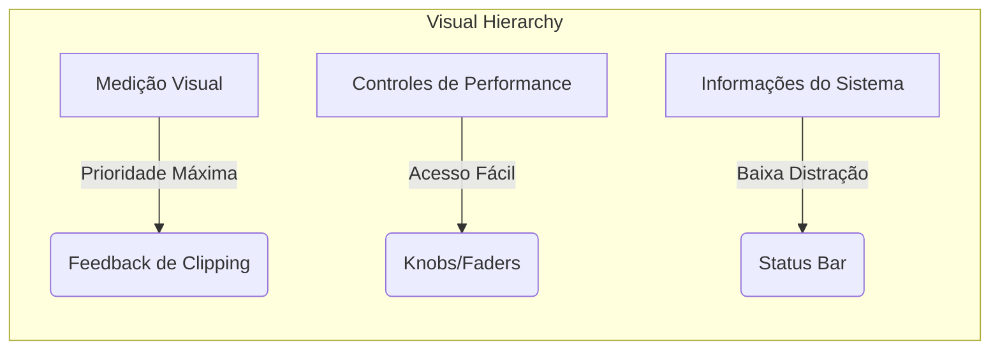
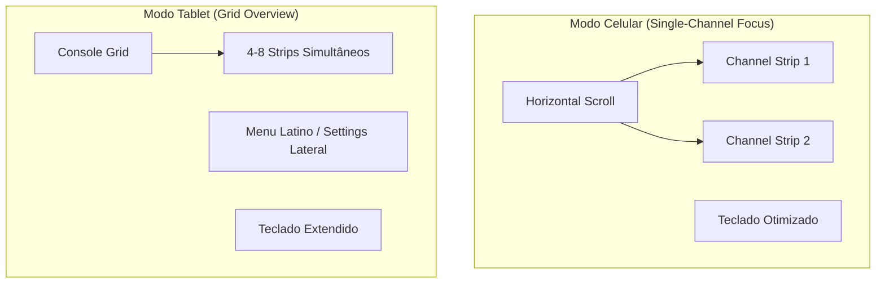

# Padrões e Requisitos de Interface: StageMobile (UI/UX)

Este documento define as diretrizes de design, padrões de componentes e heurísticas de usabilidade aplicadas ao StageMobile.

## 1. Ergonomia de Palco (Stage UX)
O design é "Touch-First" e otimizado para ambientes de baixa luminosidade.

## 2. Adaptabilidade e Layout (`isTablet`)
O layout se reorganiza drasticamente com base no tamanho da tela.

## 3. Semântica de Cores DSP
Para facilitar o reconhecimento rápido, as cores dos componentes seguem a categoria do algoritmo DSP:

| Categoria | Acento Visual | Tom (Hex) | Função Psicológica |
| :--- | :--- | :--- | :--- |
| **Spectral** | Cyan / Teal | #4FC3F7 | Clareza e Filtros |
| **Dynamics** | Red / Amber | #E57373 | Atenção e Ganho |
| **Modulation** | Green | #81C784 | Movimento e Textura |
| **Time/Space** | Purple / Violet | #BA68C8 | Profundidade |
| **Master** | Golden / Green | #FFD54F | Saída e Proteção |

## 4. Componentes de Interface Customizados (Deep Dive)

### 4.1. `DSPCircularKnob` (Controle Rotativo)
- **Visual:** Arco de luz que indica o valor atual em relação ao range (0% a 100%).
- **Comportamento:** Arraste vertical contínuo (Slide).
- **Precisão:** Display dinâmico de 2 casas decimais para frequências críticas abaixo de 10Hz.

### 4.2. `DSPMeter` (Decibelímetro)
- **Peaking:** Barra de luz que sobe e desce com decaimento suave.
- **RMS Indicator:** Barra secundária que representa a energia média percebida.
- **Clipping Warn:** O LED superior acende em vermelho sólido se o sinal ultrapassar 0dBFS.
- **`MidiLearnModifiers`:** Gerencia o estado visual de "escuta" durante o mapeamento de hardware.

## 5. Heurísticas de Interação e Gestos

### 5.1 MIDI Learn Mode
Ao acionar o MIDI Learn (ícone **AutoFixHigh**), o sistema entra em estado de escuta:
- **Cores de Estado:**
    - **Amarelo (`#xFFFFEE3B`):** Componente em modo de escuta, aguardando sinal MIDI.
    - **Verde (`#x39FF14`):** Componente já mapeado e operante.
- **Feedback Visual:** Borda pulsante (Halo) com opacidade variável para indicar atividade.
- **Confirmação:** Uso do `StageToast` fixo no topo da tela para feedbacks "Set Ativado", "Mapeado" ou "Erro".

### 5.2 Reset de Parâmetro
- **Gesto:** Double-tap (Dois toques rápidos).
- **Regra:** Retorna o parâmetro ao seu `DefaultValue` definido no modelo `DSPEffectInstance`.

## 6. Tipografia e Legibilidade
- **Labels Título:** Uso de FontWeight.ExtraBold para rápida leitura periférica.
- **Dinamismo Numérico:** Fontes monoespaçadas (ou tabular figures) nos displays de valores para evitar o "jitter" visual durante o giro dos knobs.

## 7. Diretrizes de Composição e Espaçamento de Layout

### 7.1 Containers Estruturais
- Containers estruturais (`Row`, `Column`, `Box`) devem ocupar todo o espaço disponível por padrão (`fillMaxWidth`, `fillMaxHeight` ou `fillMaxSize`).
- Evitar `wrapContent` em containers estruturais, salvo quando o tamanho depende explicitamente do conteúdo.
- Não aplicar padding diretamente em containers estruturais, exceto quando fizer parte do layout intencional.
- Utilizar `weight` para distribuição proporcional de espaço entre filhos.
- Espaçamentos devem ser explícitos (`Spacer`, `Arrangement.spacedBy`), nunca implícitos.
- Evitar aninhamento desnecessário de containers.
- Sempre declarar alinhamentos explicitamente.
- Separar containers estruturais de componentes visuais.

### 7.2 Componentes Compostos
- Elementos compostos por múltiplos subcomponentes relacionados devem ser encapsulados em um único container raiz (`Row`, `Column` ou `Box`).
- O container deve representar semanticamente o componente como uma unidade coesa.
- Evitar elementos soltos no layout; todo agrupamento lógico deve estar refletido na estrutura do código.
- A escolha do container deve seguir o layout (horizontal, vertical ou sobreposição), não sendo obrigatório o uso de `Box`.
- O componente deve ser facilmente extraível para uma função composable reutilizável.
- O espaçamento interno é responsabilidade do próprio componente, não do container pai.
- O componente deve expor um único `Modifier` externo.

## 8. Visibilidade e Hierarquia de Ações (Novo)
### 8.1 Opções de Canal Condicionais
- **Regra:** Opções avançadas ("Colorizar", "Parâmetros", "Rack de Efeitos") são exibidas apenas se o canal possuir um SoundFont carregado.
- **Vantagem:** Reduz a carga cognitiva e evita disparos de UI sobre estados vazios do motor.

## 9. Sistema de Alturas do Rack de Efeitos (Novo)
Para otimizar o espaço vertical e reduzir o scroll, o sistema utiliza alturas graduadas (propriedade `expandedHeight`):

| Tipo de Card | Altura Phone | Altura Tablet | Justificativa |
| :--- | :--- | :--- | :--- |
| **Padrão / Compressor** | 380.dp | 420.dp | Suporta 7+ parâmetros e Meters dinâmicos. |
| **Equalizador** | 260.dp | 300.dp | Formato horizontal de 3 bandas + output. |
| **Reverb** | 285.dp | 315.dp | Ajustado para mix de dials e seletor Master/Local. |
| **Compacto (Simple FX)** | 247.dp | 273.dp | 35% menor; para HPF, LPF, Chorus, Tremolo, Delay e Limiter. |

### 9.1 Ajuste de Conteúdo Compacto
Ao utilizar a altura **Compacta**, os knobs devem usar um multiplicador de escala reduzido (~1.2x a 1.4x em vez de 2.0x) e o espaçamento vertical entre linhas de knobs deve ser reduzido para 4.dp.
