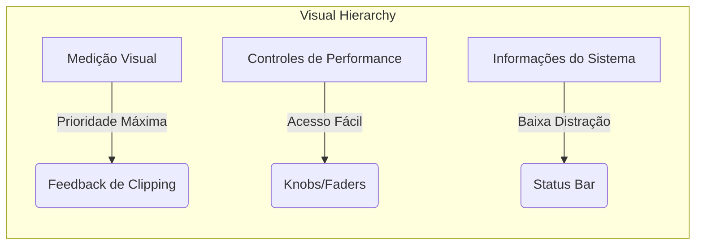
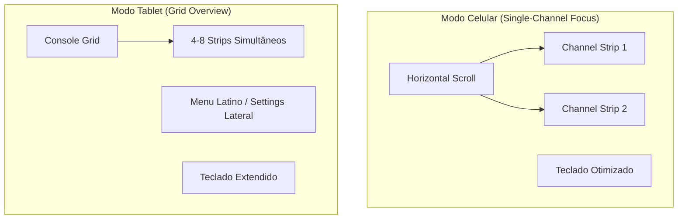

# Padrões e Requisitos de Interface: StageMobile (UI/UX)

Este documento define as diretrizes de design, padrões de componentes e heurísticas de usabilidade aplicadas ao StageMobile.

## 1. Ergonomia de Palco (Stage UX)
O design é "Touch-First" e otimizado para ambientes de baixa luminosidade.

## 2. Adaptabilidade e Layout (`isTablet`)
O layout se reorganiza drasticamente com base no tamanho da tela.

## 3. Semântica de Cores DSP
Para facilitar o reconhecimento rápido, as cores dos componentes seguem a categoria do algoritmo DSP:

| Categoria | Acento Visual | Tom (Hex) | Função Psicológica |
| :--- | :--- | :--- | :--- |
| **Spectral** | Cyan / Teal | #4FC3F7 | Clareza e Filtros |
| **Dynamics** | Red / Amber | #E57373 | Atenção e Ganho |
| **Modulation** | Green | #81C784 | Movimento e Textura |
| **Time/Space** | Purple / Violet | #BA68C8 | Profundidade |
| **Master** | Golden / Green | #FFD54F | Saída e Proteção |

## 4. Componentes de Interface Customizados (Deep Dive)

### 4.1. `DSPCircularKnob` (Controle Rotativo)
- **Visual:** Arco de luz que indica o valor atual em relação ao range (0% a 100%).
- **Comportamento:** Arraste vertical contínuo (Slide).
- **Precisão:** Display dinâmico de 2 casas decimais para frequências críticas abaixo de 10Hz.

### 4.2. `DSPMeter` (Decibelímetro)
- **Peaking:** Barra de luz que sobe e desce com decaimento suave.
- **RMS Indicator:** Barra secundária que representa a energia média percebida.
- **Clipping Warn:** O LED superior acende em vermelho sólido se o sinal ultrapassar 0dBFS.

## 5. Heurísticas de Interação e Gestos

### 5.1 MIDI Learn Mode
Ao acionar o MIDI Learn (Long-Press), o componente entra em "Listening Mode":
- **Feedback:** Overlay pulsante ou borda destacada em cor de destaque.
- **Confirmação:** Ao receber o sinal MIDI, o overlay desaparece com uma animação rápida ("Pop") confirmando o vínculo.

### 5.2 Reset de Parâmetro
- **Gesto:** Double-tap (Dois toques rápidos).
- **Regra:** Retorna o parâmetro ao seu `DefaultValue` definido no modelo `DSPEffectInstance`.

## 6. Tipografia e Legibilidade
- **Labels Título:** Uso de FontWeight.ExtraBold para rápida leitura periférica.
- **Dinamismo Numérico:** Fontes monoespaçadas (ou tabular figures) nos displays de valores para evitar o "jitter" visual durante o giro dos knobs.
